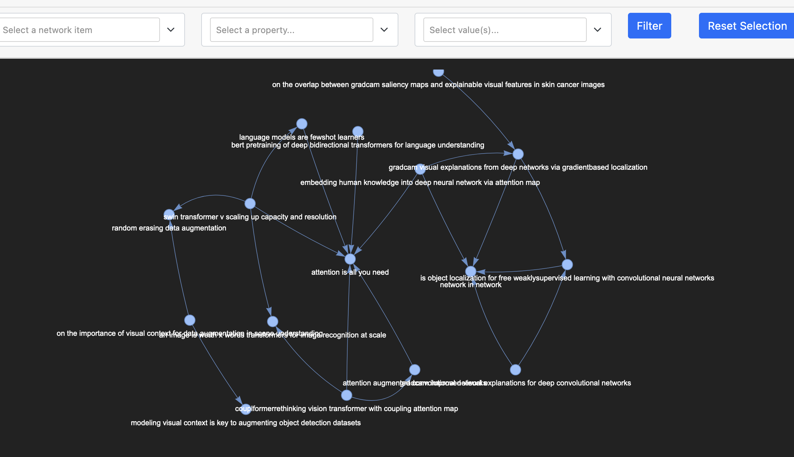
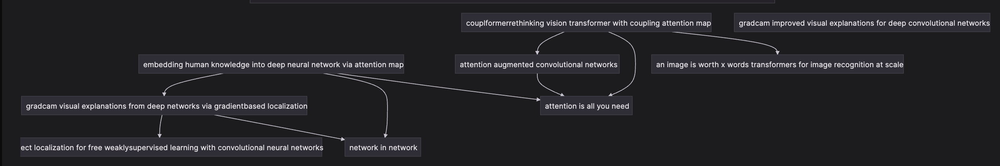

# Local Citation Graph from Zotero - mermaid + html

- Take a zotero collection -> Visualize how the papers are connected with each other as a graph
  - Use it as a graph in Obsidian if you want
  - Or just visualize it in your browser!
  - Choose the papers you want before exporting!
- FULL Credits for the conversion of the Zotero to Gephi graphs goes to [Jaks6](https://github.com/jaks6/citation_map) (I would fork but I am changing way too much)

## Examples
> These examples have a lot of _random_ papers. Just as an example
- Example zotero library
  - 
- Output graph in pyvis
  - 
  -  
- Output graph in mermaid
  - 

## How to use?
- You need Zotero!

### HTML interactive graph
- Clone this repository and cd to it
- Install requirements `pip install -r requirements.txt`
- Select and export papers to `zotero_graph.csv` from Zotero
    - Paste the file in the same directory as this repository
- Run `python3 analyze_papers.py zotero_graph.csv`
- Run `python3 plotter.py`
- This creates files in the `./gephi/` folder
- Open the file `./gephi/visuzalize_graph.html` in your browser

### Mermaid diagram
- Same as before, the mermaid code is automatically copied to the clipboard and shown as output
- Paste the output into [this website](https://mermaid.live/) or any program that supports mermaid. (like Obsidian)